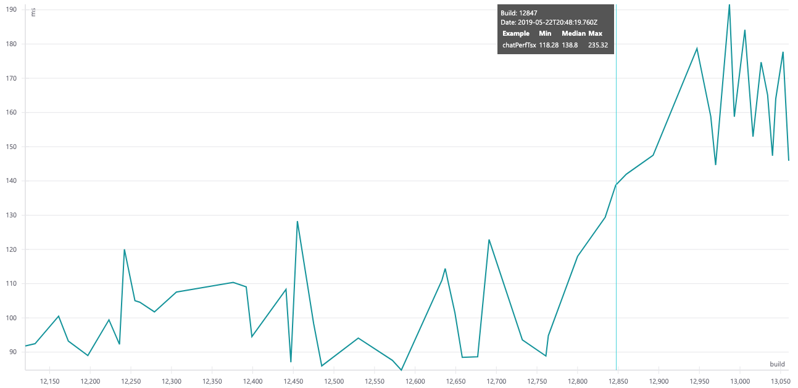

# Performance measuring

*You can't improve what you can't measure.*

As part of Stardust build pipeline we run a set of performance tests in order to avoid any regressions. This document describes the workflow.

## Measures

### Performance examples
For individual Stardust components there are usage examples in public docsite. Beside these *usage* examples there are also *performance* examples (not currently available in the public docsite). These examples render components with more data (ie list of 30 chat messages) so it takes more time (~100ms) to render them and makes any changes in render times visible.

An example measures a performance of a single component. We currently do not have any compound perf examples, like a whole page built using several Stardust components. 

### Getting the numbers
To get a performance number we use [Puppeteer](https://github.com/GoogleChrome/puppeteer) to render a performance example in headless Chrome and measure the **first render time**.

To stabilize the numbers, the example is rendered 50 times and median value is used.

## Workflow
1. With each GIT commit, build pipeline is executed in CircleCI. As part of the build, we run the performance tests for all performance examples.
2. Performance results are then stored to an external storage.
3. In Stardust docsite (not currently available in public docsite) for each measured component a performance chart is displayed, showing measures for the component from last 50 test runs.

The following picture shows a chart for `Chat` component performance example:

 - x-axis: build number (newer builds on right)
 - y-axis: first render time in milliseconds (the lower the better)
 - tooltip: details about highlighted build
 
The example chart shows that something wrong happened around build 12847 and performance decreased by ~50%. 

## Automatic PR gates
There was a plan to introduce an automated check to all PRs - to run the same tests as part of a PR build and compare them with relevant master build - and if the performance decreases then block that PR.

Unfortunately, the numbers are currently not stable enough to be used for automatic gates. In the example above you can see that even without any relevant change in code, the results differ by ~20%.

One of the reasons can be that the tests are run on a shared CI machine with non-deterministic performance and load. To mitigate this issue we tried to normalize the measures (see [#1280](https://github.com/stardust-ui/react/pull/1280) for details). Before rendering each example, we measure a baseline example which is supposed to have constant render time and then normalize the real example measure by this. However the normalized results are quite similar to the plain ones. 

So **currently, it is not possible to enable automatic PR gates for performance, but still if a real person looks at the charts performance gains/problems are noticable so we can react accordingly.** 

## Bundle size
Not only the rendering speed is affecting perceived performance. The size of the package (which affects application launch time) is equally important. For that reason we are also measuring generated bundle size of whole package as well as the size of individual themes and components.

The numbers are currently being measured and saved by the same infrastructure as the performance but are not displayed anywhere yet.

## Future plans
- explore possible ways to make the measurements more stable,
- add perf examples (charts) for more components and more variants,
- add perf examples for compound examples,
- make perf charts available in production docsite,
- make bundle size charts available in docsite,

## FAQ

### Are all components and all their variants covered?
No. We add examples as needed. If we expect a problem somewhere or a perf issue is reported, we add a new perf example which covers that area.
